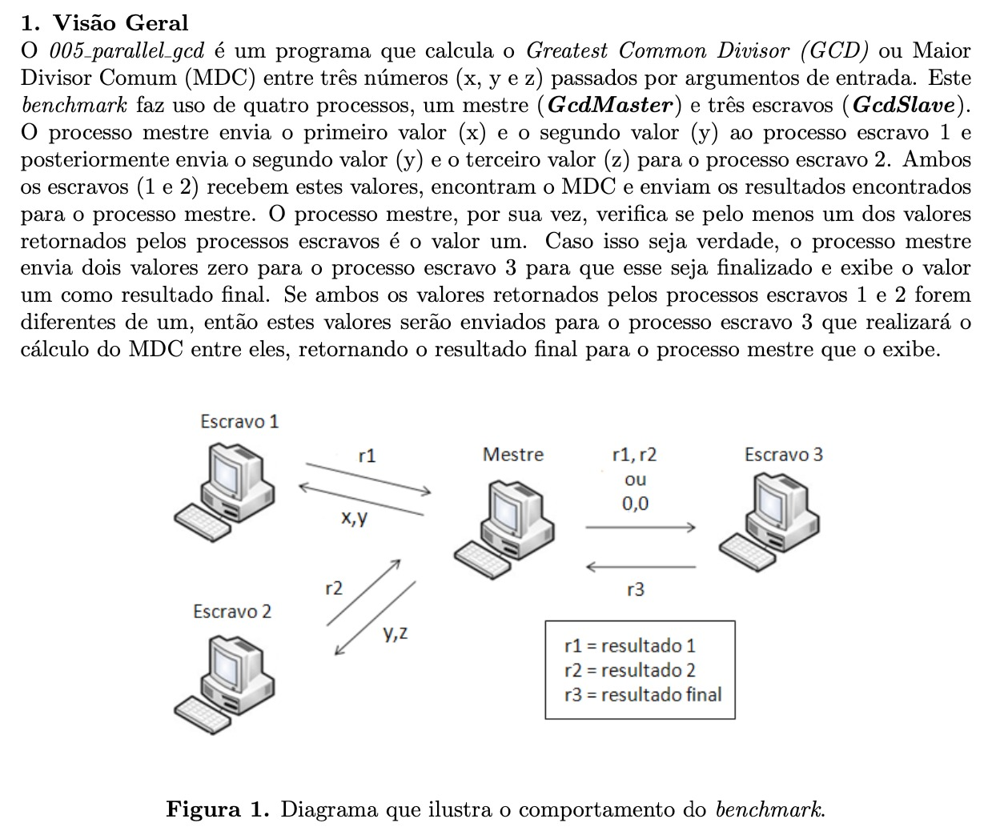

# GCD - Greatest Common Divisor

## Descrição

Este projeto utiliza computação distribuída para calcular o Máximo Divisor Comum (GCD - Greatest Common Divisor) de números, delegando o processamento a um ou mais nós, de forma sequencial, para aproveitar recursos distribuídos e melhorar a escalabilidade do cálculo.




## 📁 Estrutura do Projeto

```
/original       -> Código original disponibilizado pelo professor (Precisa citar o num, IP e Port).
/broadcast      -> Código que funciona com broadcast, sendo necessário enviar apenas os números a serem calculados e funciona com qualquer quantidade de escravos.
/broadcastLocal -> Broadcast em uma máquina só (necessário mapear várias portas diferentes).
```

## Utilização

### Original
1. Compilar as classes necessárias:
```java
    * javac GcdMaster.java HelperClass.java
    * javac GcdSlave.java
```

2. Rodar os slaves e master:
```java
    * java GcdSlave 1 3001 127.0.0.1
    * java GcdSlave 2 3002 127.0.0.1
    * java GcdSlave 3 3003 127.0.0.1
    * java GcdMaster 9 18 6 127.0.0.1 127.0.0.1 127.0.0.1
```
    

### Broadcast

1. Compilar as classes necessárias:
```java
    * javac GcdMasterM.java HelperClass.java
    * javac GcdSlaveM.java
```

2. Rodar os slaves e Master
```java
    * java GcdSlaveM 1 
    * java GcdSlaveM 2 
    * java GcdSlaveM 3 
    * java GcdMaster 9 18 6 
```

### Broadcast Local
1. Compilar as classes necessárias:

```java
    * javac GcdMasterB.java HelperClass.java
    * javac GcdSlaveB.java
```

2. Rodar os slaves e Master
```java
    * java GcdSlave 1
    * java GcdSlaveB 2 
    * java GcdSlaveB 3 
    * java GcdMaster 9 18 6 
```

## Licença

Este projeto está licenciado sob a Licença MIT.